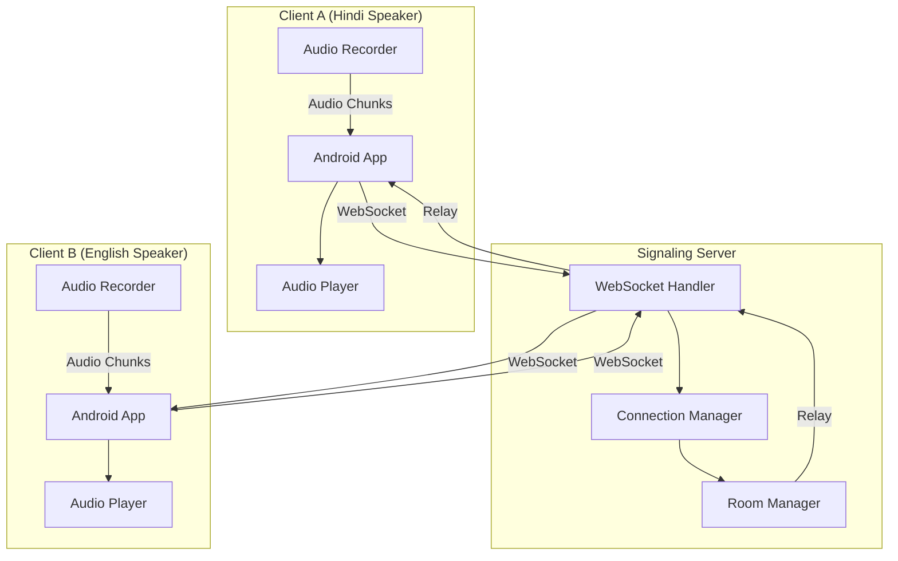
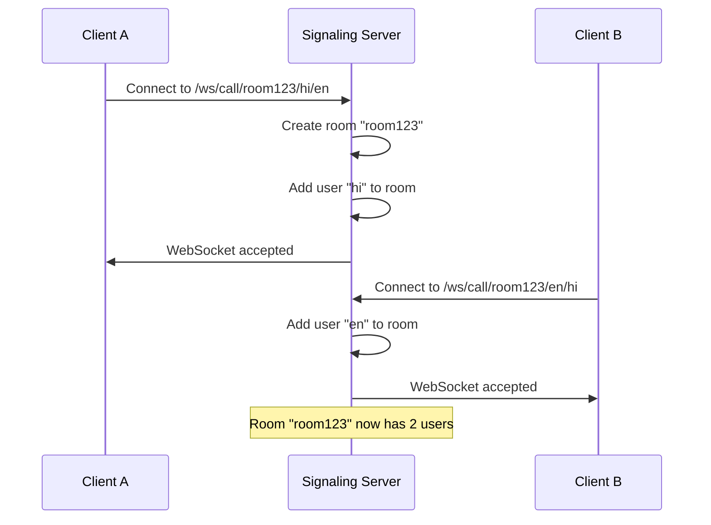
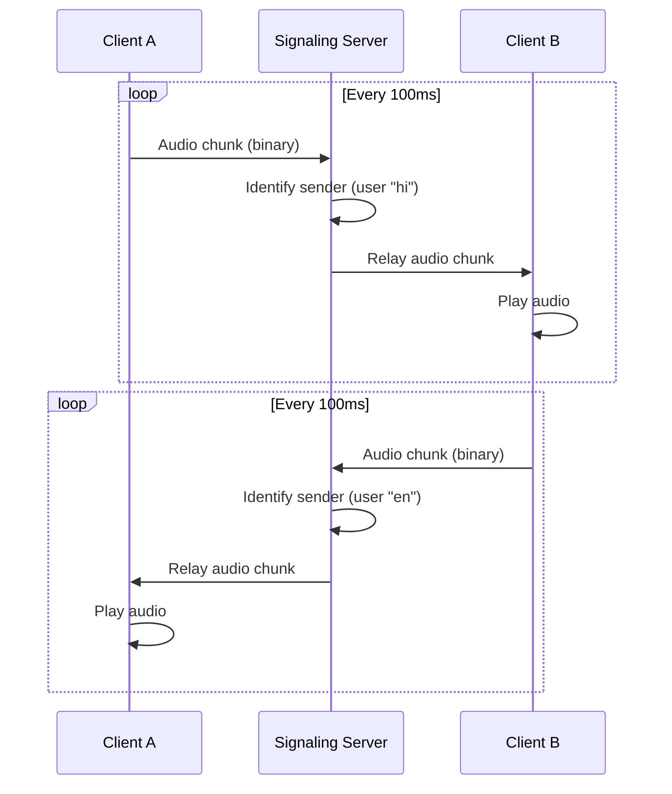
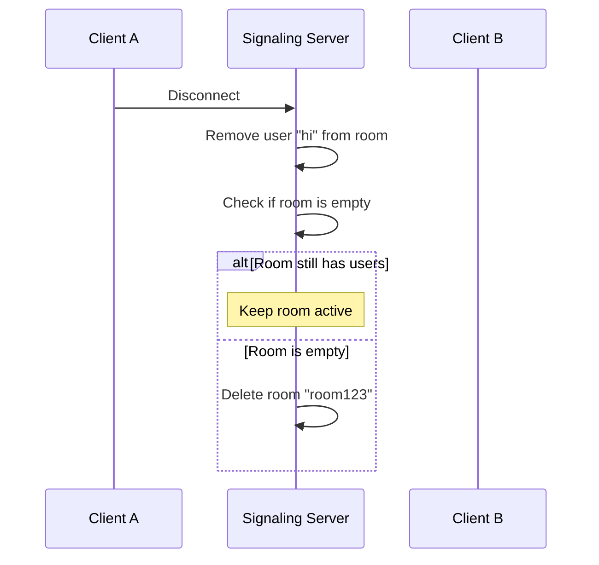

# Call Flow Documentation

This document describes the WebSocket connection flow and audio relay mechanism in the Bhasha Setu system.

## Overview

The call flow is based on a room-based WebSocket architecture where clients connect to the signaling server, join a call room, and exchange audio in real-time.

## Architecture Diagram



## Connection Flow

### 1. Client Connection

**Endpoint**: `ws://server:8000/ws/call/{call_id}/{source_lang}/{target_lang}`

**Parameters**:
- `call_id`: Unique identifier for the call room (e.g., "room123")
- `source_lang`: Language code of the speaker (e.g., "hi" for Hindi, "en" for English)
- `target_lang`: Target language for translation (used in Phase 2)

**Example**:
```
Client A: ws://server:8000/ws/call/room123/hi/en
Client B: ws://server:8000/ws/call/room123/en/hi
```

### 2. Room Creation and Joining



### 3. Audio Streaming

Once connected, clients continuously send audio chunks via WebSocket:



**Audio Format**:
- **Encoding**: PCM 16-bit
- **Sample Rate**: 16000 Hz (configurable)
- **Channels**: Mono
- **Chunk Duration**: ~100ms
- **Chunk Size**: ~3200 bytes (16000 Hz × 0.1s × 2 bytes)

### 4. Disconnection



## Connection Manager

The `ConnectionManager` class handles all WebSocket connections and room management.

### Key Methods

#### `connect(websocket, call_id, user_id)`
- Accepts WebSocket connection
- Creates room if it doesn't exist
- Adds user to room
- Logs connection event

#### `disconnect(call_id, user_id)`
- Removes user from room
- Deletes room if empty
- Logs disconnection event

#### `relay_audio(data, call_id, sender_id)`
- Receives audio chunk from sender
- Relays to all other users in the same room
- Returns count of recipients
- Handles relay errors gracefully

## Room Structure

Rooms are stored in a dictionary:

```python
rooms = {
    "room123": {
        "hi": <WebSocket object>,
        "en": <WebSocket object>
    },
    "room456": {
        "ta": <WebSocket object>,
        "te": <WebSocket object>
    }
}
```

## Error Handling

### Connection Errors
- **Scenario**: Client fails to connect
- **Handling**: Connection rejected, error logged

### Relay Errors
- **Scenario**: Failed to send audio to a recipient
- **Handling**: Error logged, other recipients still receive audio

### Disconnection Errors
- **Scenario**: Unexpected WebSocket closure
- **Handling**: User removed from room, cleanup performed

## Logging

The server logs the following events:

### Connection Events
```
✅ User hi joined room room123
📊 Room room123 now has 2 user(s)
```

### Audio Relay Events (Periodic)
```
📡 [hi] Received 50 chunks, 160,000 bytes total
🔊 Relayed 3200 bytes from hi to 1 recipient(s)
```

### Disconnection Events
```
❌ User hi left room room123
🗑️ Room room123 deleted (empty)
📊 Session stats: 500 chunks, 1,600,000 bytes received
```

## Performance Characteristics

### Latency
- **WebSocket Overhead**: < 10ms
- **Relay Processing**: < 5ms
- **Total Round-Trip**: < 50ms (network dependent)

### Throughput
- **Audio Bitrate**: ~256 kbps (16 kHz, 16-bit PCM)
- **Chunk Rate**: 10 chunks/second
- **Concurrent Calls**: Limited by server resources

### Scalability
- **Current**: Single-server, in-memory rooms
- **Future**: Redis-based room management for multi-server deployment

## Client Implementation (Android)

### Connecting
```kotlin
val webSocket = OkHttpClient().newWebSocket(
    Request.Builder()
        .url("ws://server:8000/ws/call/room123/hi/en")
        .build(),
    webSocketListener
)
```

### Sending Audio
```kotlin
// Record audio in 100ms chunks
val audioChunk = audioRecorder.read(bufferSize)
webSocket.send(ByteString.of(audioChunk, 0, audioChunk.size))
```

### Receiving Audio
```kotlin
override fun onMessage(webSocket: WebSocket, bytes: ByteString) {
    val audioData = bytes.toByteArray()
    audioPlayer.write(audioData, 0, audioData.size)
}
```

## Future Enhancements (Phase 2)

When the media server is integrated:

1. **Audio Processing Pipeline**:
   - Client A → Signaling Server → Media Server (STT) → Translation → TTS → Signaling Server → Client B

2. **Dual Mode**:
   - **Direct Mode**: Audio relay only (current)
   - **Translation Mode**: Audio → STT → Translation → TTS → Audio

3. **Adaptive Quality**:
   - Dynamic bitrate adjustment based on network conditions
   - Audio compression for bandwidth optimization

## Related Documentation

- [Translation Flow](translation-flow.md) - Phase 2 translation pipeline
- [Architecture Decisions](decisions.md) - Key design decisions
- [Signaling Server README](../signaling-server/README.md) - Server setup and API

## Troubleshooting

### Issue: No audio received
- **Check**: Both clients connected to same `call_id`
- **Check**: WebSocket connection is active
- **Check**: Audio recording permissions granted

### Issue: Choppy audio
- **Check**: Network latency and packet loss
- **Check**: Audio chunk size and rate
- **Check**: Client buffer management

### Issue: Echo or feedback
- **Check**: Audio routing on client side
- **Check**: Echo cancellation implementation
- **Check**: Headphone usage vs speaker
