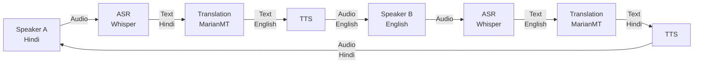
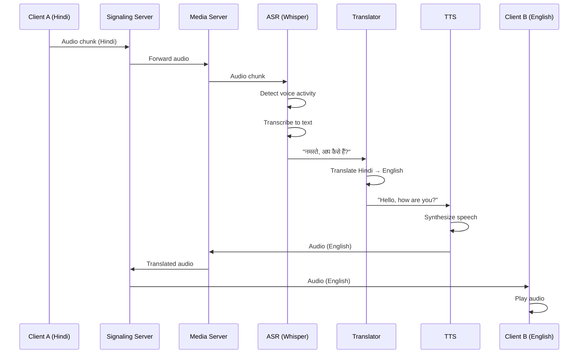

# Translation Flow Documentation (Phase 2)

> [!NOTE]
> This document describes the **planned** translation pipeline for Phase 2. The current implementation (Phase 1) only supports audio relay without translation.

## Overview

The translation flow describes how audio from one speaker is converted to speech in another language and delivered to the listener in real-time. This involves a multi-stage pipeline: Speech-to-Text (STT), Translation, and Text-to-Speech (TTS).

## High-Level Architecture



## Complete Pipeline Flow



## Pipeline Stages

### Stage 1: Automatic Speech Recognition (ASR)

**Technology**: OpenAI Whisper

**Input**: Raw audio chunks (PCM 16-bit, 16 kHz)

**Output**: Transcribed text with timestamps

**Process**:
1. **Voice Activity Detection (VAD)**
   - Detect speech vs silence
   - Dynamic threshold adjustment based on background noise
   - Minimum chunk duration: 0.5-0.7 seconds

2. **Speech Recognition**
   - Streaming transcription using Whisper
   - Language detection (if not specified)
   - Confidence scoring

3. **Post-processing**
   - Punctuation restoration
   - Number normalization
   - Disfluency removal (optional)

**Configuration**:
```python
{
    "model": "base",  # or "small", "medium", "large"
    "language": "hi",  # or auto-detect
    "vad_threshold": 0.5,
    "min_chunk_duration": 0.5,
    "max_chunk_duration": 5.0
}
```

**Latency Target**: < 500ms

### Stage 2: Translation

**Technology**: MarianMT (Helsinki-NLP models)

**Input**: Source language text

**Output**: Target language text

**Process**:
1. **Text Preprocessing**
   - Tokenization
   - Normalization
   - Context extraction from previous utterances

2. **Translation**
   - Neural machine translation
   - Context-aware translation
   - Batch processing for efficiency

3. **Post-processing**
   - Detokenization
   - Formatting restoration
   - Quality scoring

**Supported Language Pairs** (Initial):
- Hindi ↔ English
- Tamil ↔ English
- Telugu ↔ English
- Bengali ↔ English

**Configuration**:
```python
{
    "model": "Helsinki-NLP/opus-mt-hi-en",
    "batch_size": 8,
    "max_length": 512,
    "context_window": 3  # Previous utterances
}
```

**Latency Target**: < 200ms

### Stage 3: Text-to-Speech (TTS)

**Technology**: TBD (Coqui TTS, Google Cloud TTS, or Azure TTS)

**Input**: Target language text

**Output**: Synthesized audio (PCM 16-bit, 16 kHz)

**Process**:
1. **Text Analysis**
   - Phoneme conversion
   - Prosody prediction
   - Emphasis detection

2. **Audio Synthesis**
   - Neural vocoder
   - Voice selection
   - Speed and pitch adjustment

3. **Post-processing**
   - Normalization
   - Noise reduction
   - Format conversion

**Configuration**:
```python
{
    "engine": "coqui",
    "voice": "default",
    "sample_rate": 16000,
    "speed": 1.0,
    "pitch": 1.0
}
```

**Latency Target**: < 300ms

## End-to-End Flow Example

### Scenario: Hindi Speaker → English Listener

**Input**: Speaker says "नमस्ते, मैं आज दिल्ली जा रहा हूँ"

#### Step 1: ASR
```
Audio (Hindi) → Whisper
Output: "नमस्ते, मैं आज दिल्ली जा रहा हूँ"
Timestamp: 0.0s - 2.5s
Confidence: 0.95
```

#### Step 2: Translation
```
Input: "नमस्ते, मैं आज दिल्ली जा रहा हूँ"
MarianMT (hi → en)
Output: "Hello, I am going to Delhi today"
Confidence: 0.92
```

#### Step 3: TTS
```
Input: "Hello, I am going to Delhi today"
TTS Engine
Output: Audio waveform (English)
Duration: 2.8s
```

#### Total Latency
- ASR: 450ms
- Translation: 180ms
- TTS: 280ms
- **Total**: ~910ms

## Optimization Strategies

### 1. Streaming Processing
- Process audio chunks as they arrive
- Don't wait for complete utterance
- Use partial transcriptions for faster feedback

### 2. Parallel Processing
- Run ASR and TTS in parallel when possible
- Batch translation requests
- Use GPU acceleration

### 3. Caching
- Cache common phrases and translations
- Reuse TTS audio for repeated phrases
- Model caching to reduce load time

### 4. Adaptive Quality
- Adjust model size based on device capabilities
- Dynamic batch sizing
- Quality vs latency trade-offs

## Error Handling

### ASR Errors
- **Low confidence**: Request speaker to repeat
- **No speech detected**: Skip processing
- **Language mismatch**: Auto-detect and switch

### Translation Errors
- **Unknown words**: Use transliteration
- **Context errors**: Fall back to sentence-level translation
- **Model failure**: Use backup translation service

### TTS Errors
- **Synthesis failure**: Use fallback voice
- **Audio corruption**: Regenerate audio
- **Timeout**: Send text-only notification

## Quality Metrics

### ASR Quality
- **Word Error Rate (WER)**: Target < 10%
- **Real-Time Factor (RTF)**: Target < 0.5
- **Language Detection Accuracy**: > 95%

### Translation Quality
- **BLEU Score**: Target > 30
- **Semantic Similarity**: > 0.85
- **Context Preservation**: Manual evaluation

### TTS Quality
- **Mean Opinion Score (MOS)**: Target > 4.0
- **Intelligibility**: > 95%
- **Naturalness**: > 4.0 (subjective)

## Configuration Management

### Per-Language Configuration
```json
{
  "hi": {
    "asr_model": "whisper-base",
    "translation_models": {
      "en": "Helsinki-NLP/opus-mt-hi-en",
      "ta": "Helsinki-NLP/opus-mt-hi-ta"
    },
    "tts_voice": "hi-IN-female-1"
  },
  "en": {
    "asr_model": "whisper-base",
    "translation_models": {
      "hi": "Helsinki-NLP/opus-mt-en-hi",
      "ta": "Helsinki-NLP/opus-mt-en-ta"
    },
    "tts_voice": "en-US-female-1"
  }
}
```

### User Preferences
- Voice selection
- Speech speed
- Translation formality level
- Subtitle display

## Integration with Signaling Server

### Option 1: Inline Processing
```
Client → Signaling Server → Media Server → Signaling Server → Client
```
- Pros: Simple architecture
- Cons: Higher latency, single point of failure

### Option 2: Direct Connection
```
Client → Signaling Server (audio relay)
      ↓
      Media Server (processing)
      ↓
Client (translated audio)
```
- Pros: Lower latency, parallel processing
- Cons: More complex routing

### Recommended: Hybrid Approach
- Use signaling server for connection management
- Direct WebSocket to media server for audio processing
- Fallback to inline processing if direct connection fails

## Testing Strategy

### Unit Tests
- ASR accuracy on test audio samples
- Translation quality on benchmark datasets
- TTS naturalness evaluation

### Integration Tests
- End-to-end latency measurement
- Multi-speaker scenarios
- Network failure recovery

### Load Tests
- Concurrent call handling
- Resource utilization
- Scalability limits

## Future Enhancements

### Phase 2.1
- Basic STT → Translation → TTS pipeline
- Hindi ↔ English support
- Single speaker per call

### Phase 2.2
- Multi-language support (Tamil, Telugu, Bengali)
- Simultaneous speech handling
- Improved context awareness

### Phase 2.3
- Real-time subtitle display
- Speaker diarization
- Emotion preservation in TTS

### Phase 2.4
- Offline mode support
- Custom vocabulary
- Accent adaptation

## Related Documentation

- [Call Flow](call-flow.md) - WebSocket and audio relay
- [Architecture Decisions](decisions.md) - Design rationale

## References

- [OpenAI Whisper](https://github.com/openai/whisper)
- [MarianMT](https://huggingface.co/Helsinki-NLP)
- [Coqui TTS](https://github.com/coqui-ai/TTS)
